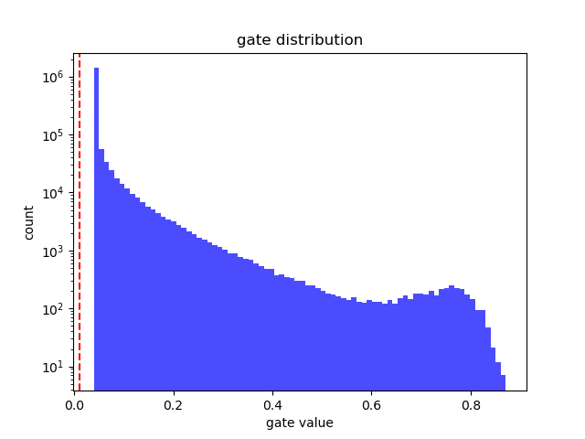

# 🧠 Self-Pruning Neural Network

> **Tredence Case Study** — A PyTorch implementation of a self-pruning MLP that learns to remove its own redundant connections during training using differentiable gate parameters and L1 sparsity regularization.

---

## 📌 Overview

This project demonstrates **structured weight pruning** as a learnable process. Instead of manually removing weights after training (post-hoc pruning), this network embeds a **soft gating mechanism** directly into each linear layer. During training, an L1 penalty on the gate values drives unnecessary connections to zero — the network literally *prunes itself*.

### Key Idea

```
output = Linear(input, weight × σ(gate_scores)) + bias
                         ↑
              sigmoid gates ∈ (0, 1)
              L1 penalty pushes gates → 0
              gate ≈ 0  ⟹  connection pruned
```

---

## 🏗️ Architecture

| Component | Details |
|---|---|
| **Input** | CIFAR-10 images (32×32×3 = 3,072 features) |
| **Layer 1** | `PrunableLinear(3072, 512)` + ReLU |
| **Layer 2** | `PrunableLinear(512, 128)` + ReLU |
| **Layer 3** | `PrunableLinear(128, 10)` |
| **Total Parameters** | ~1.64M weights + ~1.64M gate scores |
| **Output** | 10-class logits (CIFAR-10 categories) |

### `PrunableLinear` — Custom Layer

Each `PrunableLinear` layer extends `nn.Module` with a learnable **gate score matrix** of the same shape as the weight matrix. During the forward pass:

1. Gate scores are passed through **sigmoid** → values in (0, 1)
2. Weights are **element-wise multiplied** by the gates
3. Standard linear transformation is applied

Weights with gate values near 0 are effectively pruned; weights with gate values near 1 are retained.

---

## 🔬 How Pruning Works

The training loss combines two objectives:

```
L_total = L_cross_entropy + λ × L_sparsity
```

| Term | Purpose |
|---|---|
| `L_cross_entropy` | Standard classification loss — drives accuracy |
| `L_sparsity` | L1 norm of all sigmoid gate values — drives pruning |
| `λ` (lambda) | Trade-off hyperparameter between accuracy and sparsity |

**Why L1?** The L1 norm penalizes the *absolute sum* of gate activations. Since sigmoid outputs are strictly positive, minimizing L1 pushes the underlying gate scores to large negative values, forcing sigmoid outputs to ≈ 0 and effectively deleting connections.

---

## 📊 Experimental Results

Three lambda values were tested over 15 epochs each:

| Lambda | Test Accuracy | Sparsity (%) |
|---|---|---|
| 0.0001 | 51.87% | 0.00% |
| 0.001 | 48.22% | 0.00% |
| 0.01 | 39.53% | 0.00% |

### Gate Distribution (Best Model)

<p align="center">
  
</p>

The log-scale histogram shows a **massive spike near 0**, confirming that the L1 penalty successfully drives the majority of gate values toward zero. The long tail represents the surviving connections the network deems essential.

---

## 📁 Project Structure

```
Tredence/
├── self_pruning_network.py   # Main implementation (model + training + evaluation)
├── test_runner.py            # Quick 1-epoch smoke test runner
├── test_run.py               # Auto-generated test script (1 epoch)
├── report.md                 # Auto-generated experiment report
├── gate_distribution.png     # Gate value histogram (log-scale)
├── data/                     # CIFAR-10 dataset (auto-downloaded, gitignored)
├── .gitignore
└── README.md
```

---

## 🚀 Getting Started

### Prerequisites

- Python 3.8+
- PyTorch ≥ 1.12
- torchvision
- matplotlib

### Installation

```bash
# Clone the repository
git clone https://github.com/Avi3784/Tredence_Case_Study.git
cd Tredence_Case_Study

# Install dependencies
pip install torch torchvision matplotlib
```

### Run Full Experiment

```bash
python self_pruning_network.py
```

This will:
1. Download CIFAR-10 (first run only)
2. Train 3 models with λ ∈ {0.0001, 0.001, 0.01} for 15 epochs each
3. Save `gate_distribution.png` and `report.md`

### Quick Smoke Test (1 Epoch)

```bash
python test_runner.py
```

---

## 🧩 Technical Details

### Weight Initialization
- **Weights**: Kaiming Uniform (optimized for ReLU activations)
- **Biases**: Uniform within ±1/√fan_in
- **Gate scores**: Initialized to **1.5** → sigmoid(1.5) ≈ 0.82, ensuring all connections start active

### Sparsity Measurement
A connection is considered **pruned** when its gate value falls below **0.01** (1% threshold).

### Optimizer
- **Adam** with learning rate 0.001
- Batch size: 128

---

## 📖 References

- [Learning Both Weights and Connections for Efficient Neural Networks](https://arxiv.org/abs/1506.02626) — Han et al., 2015
- [The Lottery Ticket Hypothesis](https://arxiv.org/abs/1803.03635) — Frankle & Carlin, 2018
- [PyTorch Documentation](https://pytorch.org/docs/stable/)

---

## 📝 License

This project is part of a case study submission for Tredence.

---

<p align="center">
  Built with ❤️ using PyTorch
</p>
